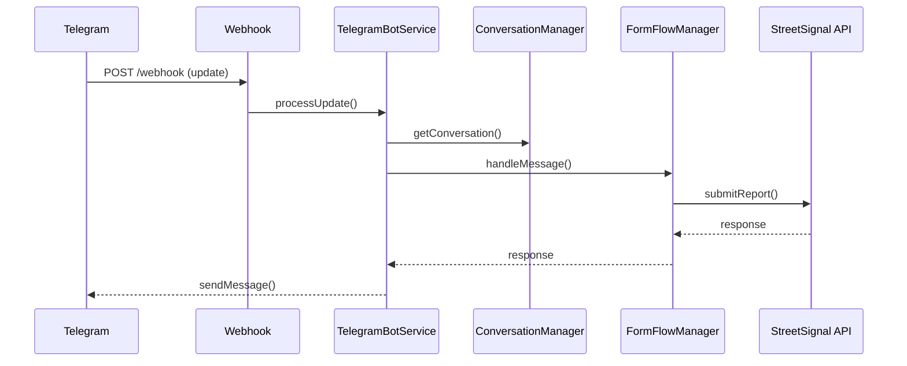
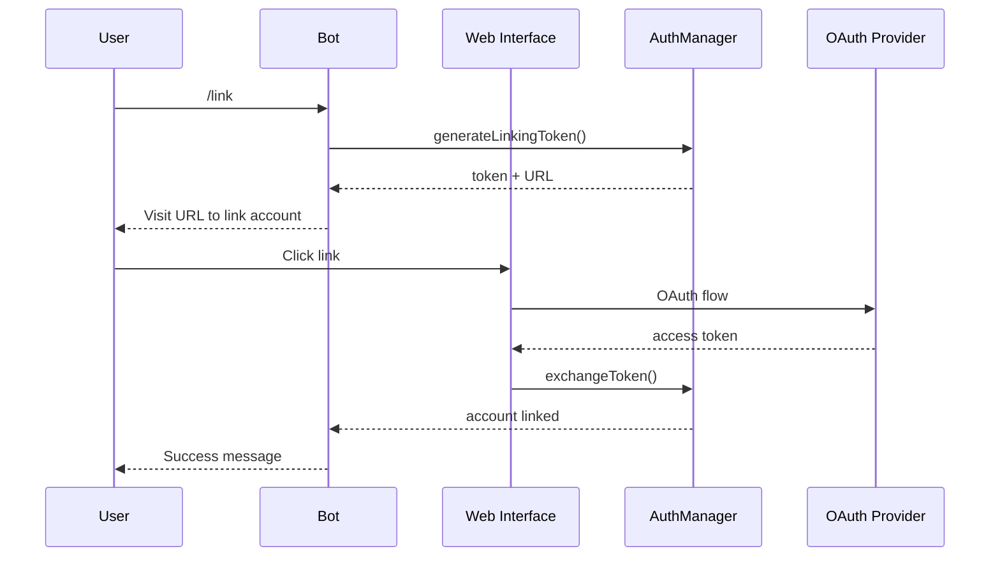

# Developer Reference

Technical documentation for developers working with the StreetSignal Telegram bot integration.

## Overview

The StreetSignal Telegram bot integration is built using Laravel for the backend and Angular for the frontend administration interface. This section provides comprehensive technical documentation for developers.

## Architecture

### System Components

```
┌─────────────────┐    ┌──────────────────┐    ┌─────────────────┐
│   Telegram      │    │   Laravel        │    │   StreetSignal  │
│   Bot API       │◄──►│   Platform       │◄──►│   API           │
└─────────────────┘    └──────────────────┘    └─────────────────┘
                              │
                              ▼
                       ┌──────────────────┐
                       │   Angular        │
                       │   Admin UI       │
                       └──────────────────┘
                              │
                              ▼
                       ┌──────────────────┐
                       │   Database       │
                       │   (MySQL/PgSQL)  │
                       └──────────────────┘
```

### Module Structure

```
src/StreetSignal/Modules/TelegramBot/
├── Http/
│   └── Controllers/
│       └── TelegramBotController.php
├── Models/
│   ├── TelegramBotConfig.php
│   ├── TelegramBotUser.php
│   └── TelegramConversation.php
├── Services/
│   ├── TelegramBotService.php
│   ├── ConversationManager.php
│   ├── AuthenticationManager.php
│   ├── FormFlowManager.php
│   └── StreetSignalApiClient.php
├── Requests/
│   └── TelegramConfigRequest.php
├── Migrations/
│   ├── 20250104_000001_create_telegram_bot_config_table.php
│   ├── 20250104_000002_create_telegram_bot_users_table.php
│   └── 20250104_000003_create_telegram_conversations_table.php
├── routes/
│   └── api.php
└── ServiceProvider.php
```

## Documentation Sections

### [API Reference](api-reference.md)
Complete API endpoint documentation with request/response examples.

### [Architecture Overview](architecture.md)
Detailed system architecture, data flow, and component interactions.

### [Database Schema](database-schema.md)
Complete database schema documentation with relationships.

### [Extension Guide](extension-guide.md)
How to extend and customize the bot functionality.

## Quick Reference

### Key Classes

| Class | Purpose |
|-------|---------|
| [`TelegramBotService`](../platform/src/StreetSignal/Modules/TelegramBot/Services/TelegramBotService.php) | Main bot orchestration and message handling |
| [`ConversationManager`](../platform/src/StreetSignal/Modules/TelegramBot/Services/ConversationManager.php) | Session state management |
| [`FormFlowManager`](../platform/src/StreetSignal/Modules/TelegramBot/Services/FormFlowManager.php) | Multi-step form handling |
| [`AuthenticationManager`](../platform/src/StreetSignal/Modules/TelegramBot/Services/AuthenticationManager.php) | Account linking and OAuth |

### Key Models

| Model | Purpose |
|-------|---------|
| [`TelegramBotConfig`](../platform/src/StreetSignal/Modules/TelegramBot/Models/TelegramBotConfig.php) | Bot configuration settings |
| [`TelegramBotUser`](../platform/src/StreetSignal/Modules/TelegramBot/Models/TelegramBotUser.php) | Telegram user profiles |
| [`TelegramConversation`](../platform/src/StreetSignal/Modules/TelegramBot/Models/TelegramConversation.php) | Conversation state |

### API Endpoints

| Endpoint | Method | Purpose |
|----------|--------|---------|
| `/api/v5/telegram/webhook` | POST | Webhook for Telegram updates |
| `/api/v5/telegram/config` | GET/PUT | Bot configuration management |
| `/api/v5/telegram/setup` | POST | Webhook setup |
| `/api/v5/telegram/stats` | GET | Usage statistics |

## Development Setup

### Prerequisites

```bash
# PHP 8.0+ with extensions
php -v
php -m | grep -E "(curl|json|mbstring|xml)"

# Composer
composer --version

# Node.js and npm (for frontend)
node --version
npm --version
```

### Installation

```bash
# 1. Install backend dependencies
composer require telegram-bot/api:^2.3

# 2. Run migrations
php artisan migrate

# 3. Install frontend dependencies
cd apps/web-mzima-client
npm install

# 4. Configure environment
cp .env.example .env
# Edit .env with your settings
```

### Testing

```bash
# Run backend tests
php artisan test --filter=TelegramBot

# Run frontend tests
cd apps/web-mzima-client
npm run test

# Integration testing with ngrok
ngrok http 8000
# Update TELEGRAM_WEBHOOK_URL in .env
```

## Configuration

### Environment Variables

```bash
# Required
TELEGRAM_BOT_TOKEN=your_bot_token
TELEGRAM_WEBHOOK_URL=https://yourdomain.com/api/v5/telegram/webhook
TELEGRAM_SERVICE_TOKEN=your_service_token

# Optional
TELEGRAM_RATE_LIMIT_MESSAGES=10
TELEGRAM_SESSION_TIMEOUT=30
TELEGRAM_DEBUG_MODE=false
```

### Service Registration

The module is automatically registered via [`ServiceProvider`](../platform/src/StreetSignal/Modules/TelegramBot/ServiceProvider.php):

```php
// config/app.php
'providers' => [
    // ...
    StreetSignal\Modules\TelegramBot\ServiceProvider::class,
],
```

## Data Flow

### Webhook Processing



### Account Linking Flow



## Security

### Webhook Verification

```php
// Verify webhook signature
private function validateWebhook(Request $request): bool
{
    $telegramIps = [
        '149.154.160.0/20',
        '91.108.4.0/22'
    ];
    
    $clientIp = $request->ip();
    
    foreach ($telegramIps as $range) {
        if ($this->ipInRange($clientIp, $range)) {
            return true;
        }
    }
    
    return false;
}
```

### Rate Limiting

```php
// Rate limiting configuration
'rate_limits' => [
    'messages_per_minute' => 10,
    'reports_per_hour' => 5,
    'reports_per_day' => 20,
],
```

### Token Security

- Bot tokens stored encrypted in database
- OAuth tokens encrypted at rest
- Service tokens use Laravel's encryption
- Webhook secrets for signature verification

## Performance

### Optimization Tips

1. **Database Indexing**: Key fields are indexed for performance
2. **Session Storage**: Use Redis for better session performance
3. **Webhook Response**: Must respond within 60 seconds
4. **File Uploads**: Configure appropriate size limits
5. **Rate Limiting**: Prevent abuse and ensure fair usage

### Monitoring

```php
// Log important events
Log::info('Telegram bot message processed', [
    'user_id' => $userId,
    'chat_id' => $chatId,
    'command' => $command
]);
```

## Troubleshooting

### Common Development Issues

**Bot not receiving updates**:
- Check webhook URL accessibility
- Verify SSL certificate
- Check Telegram IP whitelist

**Database connection errors**:
- Verify database credentials
- Check migration status
- Ensure proper permissions

**Authentication failures**:
- Verify service token
- Check OAuth configuration
- Ensure API endpoints accessible

### Debug Tools

```bash
# Check bot configuration
php artisan tinker
>>> TelegramBotConfig::first()

# Test API connectivity
>>> app(StreetSignalApiClient::class)->checkHealth()

# Clear expired conversations
>>> app(ConversationManager::class)->cleanupExpiredConversations()
```

## Contributing

### Code Standards

- Follow PSR-12 coding standards
- Add unit tests for new functionality
- Update documentation for API changes
- Test with actual Telegram bot before submitting

### Pull Request Process

1. Fork the repository
2. Create feature branch
3. Add tests and documentation
4. Submit pull request with clear description

---

**Next Steps**: Explore the [API Reference](api-reference.md) for detailed endpoint documentation or check the [Architecture Overview](architecture.md) for system design details.