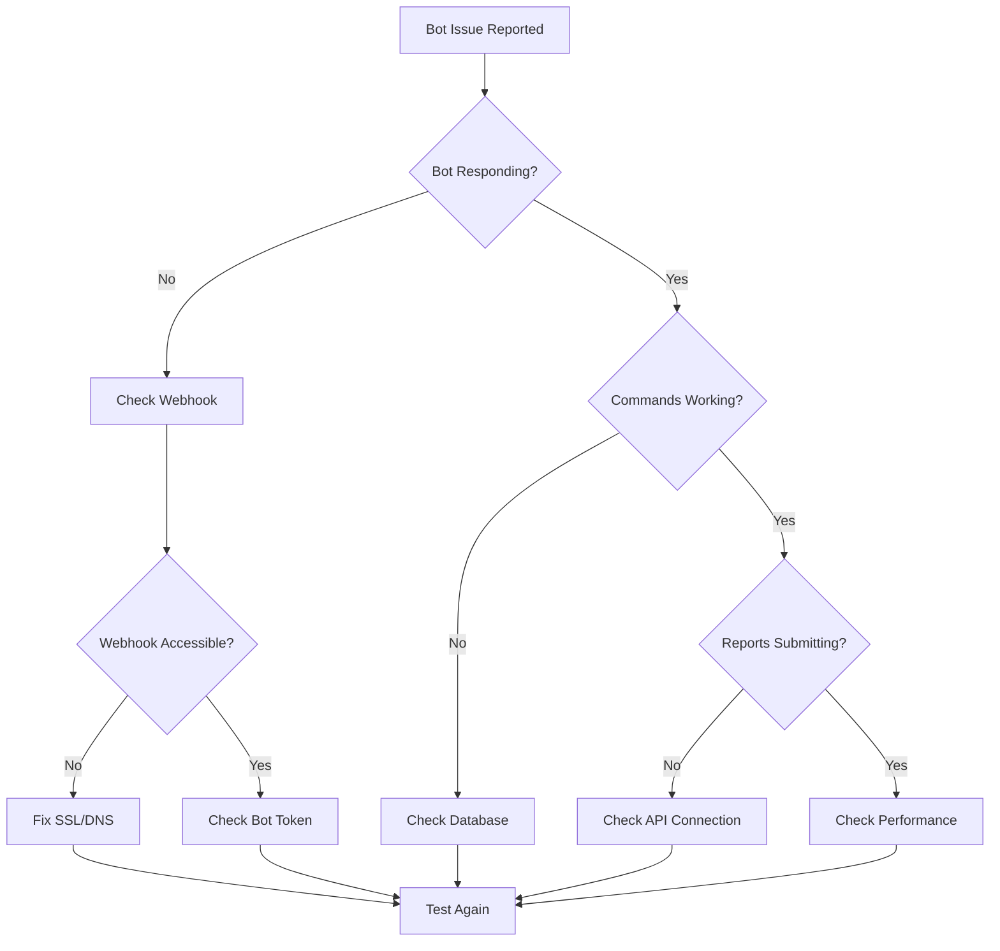

# Troubleshooting Guide

Comprehensive troubleshooting guide for the StreetSignal Telegram bot integration.

## Quick Diagnosis

### Bot Not Responding

**Symptoms**: Bot doesn't respond to messages or commands

**Quick Checks**:
1. ✅ Bot token configured correctly
2. ✅ Webhook URL accessible via HTTPS
3. ✅ Database connection working
4. ✅ Laravel logs show no errors

**Quick Fix**:
```bash
# Test webhook connectivity
curl -X POST https://yourdomain.com/api/v5/telegram/webhook \
  -H "Content-Type: application/json" \
  -d '{"test": true}'

# Check bot configuration
php artisan tinker
>>> TelegramBotConfig::first()
```

### Webhook Setup Failed

**Symptoms**: "Failed to setup webhook" error in admin interface

**Quick Checks**:
1. ✅ Domain has valid SSL certificate
2. ✅ Webhook URL returns 200 status
3. ✅ Bot token is valid

**Quick Fix**:
```bash
# Test SSL certificate
curl -I https://yourdomain.com

# Verify bot token
curl "https://api.telegram.org/bot{YOUR_BOT_TOKEN}/getMe"
```

### Reports Not Submitting

**Symptoms**: Bot accepts reports but they don't appear in StreetSignal

**Quick Checks**:
1. ✅ Service token configured
2. ✅ StreetSignal API accessible
3. ✅ Survey/form configuration correct

**Quick Fix**:
```bash
# Test API connectivity
php artisan tinker
>>> app(\StreetSignal\Modules\TelegramBot\Services\StreetSignalApiClient::class)->checkHealth()
```

## Troubleshooting Sections

### [Common Issues](common-issues.md)
Most frequently encountered problems and their solutions.

### [Error Reference](error-reference.md)
Complete catalog of error codes and diagnostic steps.

### [Debug Tools](debug-tools.md)
Tools and commands for diagnosing problems.

### [Performance Tuning](performance-tuning.md)
Optimization guidelines and scaling recommendations.

## Diagnostic Flowchart



## Emergency Checklist

When the bot is completely down, check these in order:

### 1. Infrastructure (2 minutes)
- [ ] Server is running and accessible
- [ ] Database is running and accessible
- [ ] SSL certificate is valid
- [ ] Domain DNS is resolving correctly

### 2. Configuration (2 minutes)
- [ ] Bot token is correct in admin panel
- [ ] Webhook URL is correct and accessible
- [ ] Environment variables are set
- [ ] Database migrations are up to date

### 3. Application (3 minutes)
- [ ] Laravel application is running
- [ ] No errors in Laravel logs
- [ ] Telegram bot service is enabled
- [ ] API endpoints are responding

### 4. Telegram Integration (3 minutes)
- [ ] Bot responds to direct API calls
- [ ] Webhook is registered with Telegram
- [ ] Bot has correct permissions
- [ ] Rate limits are not exceeded

## Log Analysis

### Key Log Locations

```bash
# Laravel application logs
tail -f storage/logs/laravel.log

# Web server logs
tail -f /var/log/nginx/error.log
tail -f /var/log/apache2/error.log

# System logs
tail -f /var/log/syslog
```

### Important Log Patterns

**Successful webhook processing**:
```
[INFO] Telegram bot message processed {"user_id":123,"chat_id":456,"command":"/start"}
```

**Webhook validation failure**:
```
[WARNING] Invalid Telegram webhook signature {"ip":"1.2.3.4"}
```

**API connection issues**:
```
[ERROR] StreetSignal API connection failed {"endpoint":"posts","error":"Connection timeout"}
```

**Rate limiting triggered**:
```
[INFO] Rate limit exceeded {"user_id":123,"limit_type":"messages_per_minute"}
```

## Health Check Commands

### System Health

```bash
# Check all services
systemctl status nginx php8.0-fpm mysql redis

# Check disk space
df -h

# Check memory usage
free -h

# Check network connectivity
ping google.com
```

### Application Health

```bash
# Laravel health check
php artisan route:list | grep telegram
php artisan config:show telegram

# Database connectivity
php artisan tinker
>>> DB::connection()->getPdo()

# Cache status
php artisan cache:clear
php artisan config:clear
```

### Telegram Integration Health

```bash
# Test bot token
curl "https://api.telegram.org/bot{TOKEN}/getMe"

# Check webhook status
curl "https://api.telegram.org/bot{TOKEN}/getWebhookInfo"

# Test webhook endpoint
curl -X POST https://yourdomain.com/api/v5/telegram/webhook \
  -H "Content-Type: application/json" \
  -d '{"update_id":1,"message":{"message_id":1,"date":1234567890,"chat":{"id":123,"type":"private"},"from":{"id":123,"is_bot":false,"first_name":"Test"},"text":"/start"}}'
```

## Performance Monitoring

### Key Metrics to Monitor

| Metric | Normal Range | Alert Threshold |
|--------|--------------|-----------------|
| Webhook Response Time | < 1 second | > 5 seconds |
| Database Query Time | < 100ms | > 500ms |
| Memory Usage | < 80% | > 90% |
| Disk Space | < 80% | > 90% |
| Error Rate | < 1% | > 5% |

### Monitoring Commands

```bash
# Response time monitoring
curl -w "@curl-format.txt" -o /dev/null -s https://yourdomain.com/api/v5/telegram/webhook

# Database performance
mysql -e "SHOW PROCESSLIST;"

# Memory usage
ps aux | grep php | awk '{sum+=$6} END {print sum/1024 " MB"}'
```

## Recovery Procedures

### Quick Recovery Steps

1. **Restart Services**:
```bash
sudo systemctl restart nginx
sudo systemctl restart php8.0-fpm
sudo systemctl restart mysql
```

2. **Clear Caches**:
```bash
php artisan cache:clear
php artisan config:clear
php artisan route:clear
```

3. **Reset Webhook**:
```bash
# Via admin interface or API
curl -X POST https://yourdomain.com/api/v5/telegram/setup \
  -H "Authorization: Bearer YOUR_API_TOKEN"
```

### Full Recovery Process

If the bot is completely non-functional:

1. **Backup Current State**:
```bash
mysqldump streetsignal_telegram > backup_$(date +%Y%m%d_%H%M%S).sql
```

2. **Verify Infrastructure**:
```bash
# Check all prerequisites from deployment guide
```

3. **Restore Configuration**:
```bash
# Restore from known good configuration
# Re-run deployment steps if necessary
```

4. **Test Functionality**:
```bash
# Follow verification steps from quick start guide
```

## Getting Help

### Before Contacting Support

1. **Gather Information**:
   - Error messages from logs
   - Steps to reproduce the issue
   - Recent changes made to the system
   - Current configuration (sanitized)

2. **Try Basic Fixes**:
   - Restart services
   - Clear caches
   - Check recent changes

3. **Document the Issue**:
   - What was working before?
   - What changed?
   - What error messages appear?
   - What troubleshooting steps were tried?

### Support Channels

- **Documentation**: Check all relevant documentation sections
- **Logs**: Include relevant log excerpts (sanitized)
- **Configuration**: Provide configuration details (remove sensitive data)
- **Environment**: Describe your server environment and setup

---

**Need immediate help?** Start with [Common Issues](common-issues.md) for the most frequent problems and solutions.